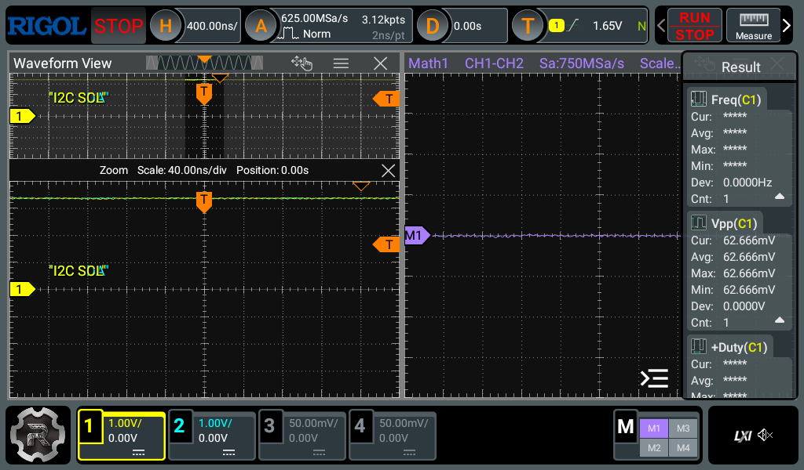

# rigol-mcp

A standards-based [Model Context Protocol](https://modelcontextprotocol.io/) server
for controlling a Rigol oscilloscope over LAN/TCPIP. Any MCP client supporting
stdio can discover its tools, configure the instrument, take measurements and
retrieve captures. No particular agent or client is required.



## Scope Support

The programming reference is Rigol's **DHO800/DHO900** guide.
The **DHO814 belongs to the DHO800 series** and is the primary tested target.
Its model-filtered command catalog and streamed memory downloads are enabled
specifically for DHO814; this is not a claim of complete support for every model
covered by the guide.

Existing DS1000Z/MSO1000Z and DHO924S convenience-tool support is retained separately.
Other families are not verified. See [DHO814 support](docs/dho814-support.md) for
reference provenance, coverage, model exclusions and hardware verification.

## Requirements

- A supported scope reachable over Ethernet on TCP port **5555**.
- An MCP client that can launch a stdio server.
- Docker, or Apple's `container` runtime on Apple silicon, installed and running
  with its CLI available to the MCP client.

The server runs only in containers. No host Python, uv, or native installation is required.

## Installation

```bash
git clone https://github.com/gloveboxes/rigol-mcp
cd rigol-mcp
```

### Docker

Build the lightweight Alpine image and pass the scope address at runtime:

```sh
docker build -t rigol-mcp:local .
docker run --rm -i \
  -e RIGOL_IP=192.168.1.123 \
  --mount type=volume,src=rigol-mcp-data,dst=/data \
  rigol-mcp:local
```

The MCP client normally launches this command. Use `-i`, not `-t`; no ports need
publishing. See [Docker setup](docs/docker.md) for client configuration, persistent
storage, hardened launch options and the stdio-versus-HTTP tradeoff.

### Apple Silicon Container

On Apple silicon, Apple Container can build the same image and run it without
Docker Desktop:

```sh
container system start
container build -t rigol-mcp:local .
```

Initialize the Apple capture volume once so the non-root server can write to it:

```sh
container run --rm --progress none --user 0 \
  --mount type=volume,source=rigol-mcp-data,target=/data \
  --entrypoint sh rigol-mcp:local -c \
  'mkdir -p /data/captures /data/screenshots && chown 10001:10001 /data /data/captures /data/screenshots'
```

Then launch the server:

```sh
container run --rm -i --read-only --progress none \
  --tmpfs /tmp --cap-drop ALL \
  -e RIGOL_IP=192.168.1.123 \
  --mount type=volume,source=rigol-mcp-data,target=/data \
  rigol-mcp:local
```

Apple Container keeps images and volumes separately from Docker. See the full
[Apple Container setup](https://github.com/gloveboxes/rigol-mcp/blob/main/docs/apple-container.md)
for VS Code configuration, storage and networking details.

## Configuration

Find the scope's address in its LAN settings and replace `192.168.1.123` in the
examples. Ensure TCP port 5555 is reachable. LAN/TCPIP is the only supported
instrument transport.

Pass `RIGOL_IP` with Docker's `-e` option, as shown above, or set it in the MCP
client configuration below. No environment file is required and no IP address
is baked into the image. Docker's `--env-file` remains an optional alternative
for managing runtime variables.

| Variable | Container Default | Purpose |
|---|---|---|
| `RIGOL_IP` | (required) | Scope IP address |
| `RIGOL_ENABLE_SEND_RAW` | (unset) | Set to `1` for unrestricted SCPI; see [Safety](#safety) |
| `RIGOL_SCREENSHOT_DIR` | `/data/screenshots` | Directory for saved PNG screenshots |
| `RIGOL_DATA_DIR` | `/data/captures` | Directory for waveform CSV downloads and binary/large SCPI responses |

Docker stores captures and screenshots under `/data`; mount it to retain files
after the container exits. Returned paths are container paths, not host paths.

## MCP Client Setup

Configure your client to launch the Docker container over stdio:

```json
{
  "command": "docker",
  "args": [
    "run", "--rm", "-i", "--read-only",
    "--tmpfs", "/tmp:rw,noexec,nosuid,size=16m",
    "--cap-drop=ALL", "--security-opt=no-new-privileges",
    "-e", "RIGOL_IP",
    "--mount", "type=volume,src=rigol-mcp-data,dst=/data",
    "rigol-mcp:local"
  ],
  "env": {
    "RIGOL_IP": "192.168.1.123"
  }
}
```

The surrounding configuration format depends on the client; this is a process
configuration example, not a universal MCP configuration file. VS Code users can
use the included [.vscode/mcp.json](.vscode/mcp.json), editing `env.RIGOL_IP` for
their scope. Select **rigol** for Docker or **rigol-apple** for Apple Container,
and disable the other entry; do not run both against one scope. See
[Docker MCP client configuration](docs/docker.md#mcp-client-configuration) or
[Apple Container setup](docs/apple-container.md) for prerequisites.

## Discover Before Acting

MCP tool discovery supplies descriptions and input schemas. Measurement lists and
command signatures do not need to be copied from this README.

1. Call `idn` to verify connectivity, model and firmware.
2. Call `get_capabilities` for supported channels, measurements and model features.
3. Call `get_scope_state` for current channel, timebase and trigger settings.
4. Use the advertised convenience tools for common tasks. For other DHO814 operations,
   search `scpi_catalog`, request one command's details, then use `scpi_execute`.

`get_capabilities` labels each fact in an `evidence` map as **hardware-verified**,
**documented**, or **unverified**. By default it checks DHO800/900 channel and grid
counts against the scope, reporting model mismatches. Other facts still rely on
model definitions; measurement lists do not establish measurement accuracy.
Documented facts come from a locally reviewed, versioned dataset with publication,
section and page citations. CI checks its consistency with the pinned command
catalog; no reference material is fetched or trusted automatically at runtime.
Use `verify_hardware=false` to skip these extra queries. See
[capability evidence](docs/dho814-support.md#capability-evidence) for limitations.
`scpi_catalog` comes from the bundled programming-guide reference, not from an
API downloaded from the scope.

Example request to an agent:

> Identify the scope, check its capabilities and current settings, then measure
> frequency and peak-to-peak voltage on channel 1.

## Agent Data Usage

Prefer numeric readings and local waveform analysis. Large results and raw arrays
stay in files with compact metadata; images and inline binary are opt-in. Use
`read_capture` for specific bounded excerpts, not entire files. Full data is retained.
See [transfer and output limits](docs/dho814-support.md#transfers).

## Safety

Use one server instance per physical scope and call instrument tools sequentially.
Only trusted clients should have access: operations can change acquisition,
overwrite scope files, reset the instrument, lock controls or change LAN settings.

Unrestricted `send_raw` is disabled by default. The documented DHO814 catalog is
available without enabling it; catalog membership does not make an operation
non-destructive. State-changing operations, error-queue reads and memory downloads
are not automatically replayed after communication failures. A failed readback
can follow a successful write; inspect current state before repeating a change.

## Testing

The default suite is offline and needs no instrument. See
[container-based development checks](docs/development.md) to run tests or audit
reference data without installing Python on the host. Image smoke tests also run
in CI; see [Docker tests](docs/docker.md#container-tests).
DHO814 LAN smoke tests passed on firmware 00.01.05 without an input signal.
Signal accuracy, exhaustive command behavior, full-depth transfers and fault
recovery remain unverified. See [hardware test coverage and instructions](docs/dho814-support.md#verification-and-maintenance)
before running the opt-in live test, which temporarily changes scope settings.

## Acknowledgements

This independent project is based on
[erebusnz/rigol-mcp](https://github.com/erebusnz/rigol-mcp), originally created by
Stig Manning. The original MIT license and copyright notice are preserved.

## License

MIT — see [LICENSE](LICENSE).
