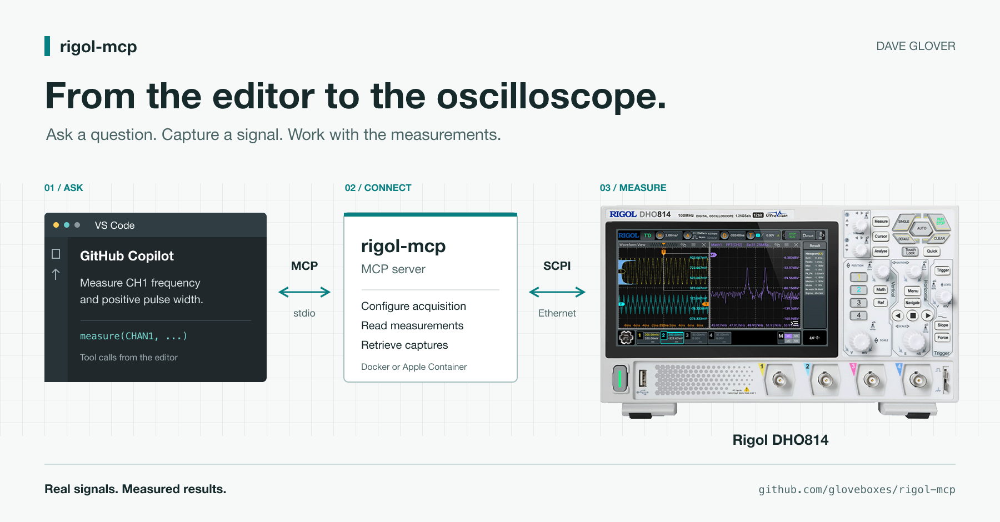

# Connecting GitHub Copilot to My Oscilloscope

Using MCP, a Rigol DHO814, and a Raspberry Pi Pico to bring real measurements into the development workflow.

Firmware can look perfectly reasonable in the editor. That does not tell you whether the pulse on the pin is the right width or what your I2C bus is actually sending.

The oscilloscope is new to me, and I'm still learning what it can do. Building and extending the MCP server has been a practical way to explore its capabilities while bringing it into my agent development workflow.

With [rigol-mcp](https://github.com/gloveboxes/rigol-mcp), GitHub Copilot can query the scope directly and use its measurements while I work on the code. My test setup is a Rigol DHO814 and a Raspberry Pi Pico 2 W, with Copilot in VS Code.

## First, Credit Where It Is Due

This project builds on [erebusnz/rigol-mcp](https://github.com/erebusnz/rigol-mcp), originally created by **Stig Manning**. The original MIT licence and copyright notice are preserved.

I've since done considerable work to expand the server, particularly for the DHO814: coordinated acquisition, protocol decoding, waveform analysis, statistics, recording/replay, and verification that the scope actually applied the requested settings.

Several things that were perfectly acceptable to a mocked instrument turned out to be rather less acceptable to the one on my desk.

## What the Connection Looks Like

GitHub Copilot connects to the MCP server from VS Code. The server runs in a container and talks to the Rigol over Ethernet. On the bench, the scope probes measure signals generated by the Pico.

MCP gives the assistant tools it can discover and call. The server translates those calls into SCPI, the instrument's command interface. Other MCP clients supporting stdio can use it too.

For example:

> Save the scope setup. Configure CH1 and CH2 for two 3.3 V signals at 1 MHz, capture them together, and measure their phase difference. Ask before restoring the saved setup.

The response comes from instrument measurements rather than an estimate based on a screenshot.

## A Pico Makes a Useful Test Source

I used the Pico 2 W to generate known signals on GP16 and GP18, connected to scope channels 1 and 2. Both probes were set to 10X, with short ground connections.

The 12-case PWM sweep covered duty cycles, narrow pulses, divider boundaries, and phase offsets. Integer clock dividers removed the cycle-length variation that fractional division can introduce, without pretending the whole measurement system was jitter-free.

Results included a 13.35 ns pulse and a nominal 180-degree offset measured at 179.64 degrees with a 500 ns delay.

One detail mattered: with the selected integer timing, the requested 90-degree offset at 1 MHz became an actual target of 91.2 degrees. The scope measured 91.08 degrees.

Comparing against the requested label alone would have made a good result look wrong.

## The Scope Also Helped Debug the Server

The DHO814 could ignore a horizontal-scale change while acquisition was stopped. Sending a command successfully was not proof that anything had changed. The timing tool now briefly runs acquisition to apply those settings, returns it to STOP, and checks the readback.

Another test produced apparently excessive voltage swing. Raw minima and maxima included overshoot and undershoot, so the analysis now reports those separately from settled logic levels.

I also caught static PWM being described as modulated because sampling differences changed the estimated duty cycle. The analysis now reports confidence and sample counts, and avoids treating small variations as modulation.

I would rather get a qualified measurement than a very precise-looking number with the wrong interpretation.

## Reading I2C, SPI, and UART

Next, I generated protocol traffic on the Pico and tested the scope's decoders through MCP:

- UART at 115200 baud, decoding "RIGOL MCP 55 AA" with CR/LF.
- I2C, decoding a write to 7-bit address 0x50, data 0xA5, and a low ACK bit.
- SPI at 100 kHz, mode 0, decoding MOSI 0xA5 using timeout framing instead of a separate chip-select probe.

Thresholds mattered as much as source selection. The decoder tool now accepts explicit voltage thresholds. A useful request is:

> Configure I2C decoding with SCL on CH1 and SDA on CH2, both at a 1.65 V threshold. Trigger on START, capture a complete transaction, and return the decoded address and data.

The Pico I2C generator is a scope-only fixture with push-pull outputs, not something to attach to a shared bus. Real I2C needs open-drain signalling and pull-ups.

## Measurements Before Screenshots

Screenshots help with display questions: zoom windows, overlays, and cursor positions. For frequency or decoded bytes, structured data is more useful. Saved captures keep the large waveform arrays out of the conversation while giving the assistant a summary and a file path.

## Trying It on Your Bench

You'll need a supported Rigol scope reachable over Ethernet and an MCP client. The server runs with Docker on Windows, Linux, and macOS, or Apple Container on macOS. The DHO814 is the primary hardware-tested target.

Follow the [README](https://github.com/gloveboxes/rigol-mcp#readme), choose one runtime, set RIGOL_IP to your scope's address, and start the rigol-scope server in your client. No host Python installation is needed.

Check probe attenuation, voltage limits, and grounding. Scope ground clips are not floating inputs. Use one server per scope, save the setup before broad changes, and verify restoration afterwards. An assistant cannot check your physical wiring for you.

## What Has Actually Been Tested?

Live testing also exercised statistics, cursors, search, mask counters, recording/replay, meters, math/reference operations, and RAW transfers. The [acceptance report](https://github.com/gloveboxes/rigol-mcp/blob/main/docs/reports/dho814_advanced_mcp_acceptance_report.json) records the limits of that work.

Not all 897 catalog query/write forms have been hardware-tested. CAN and parallel decoding, deliberate network failures, and disruptive operations remain outside this acceptance run. Exercising a meter tool is not a calibration certificate.

## Back to the Firmware

For me, the useful part is keeping a hardware question close to the code that caused it. Generate a signal, capture it, and make the next change with evidence from the pin, rather than just a discussion of what the firmware ought to do.

The code is on [GitHub](https://github.com/gloveboxes/rigol-mcp). Questions or results from another Rigol model? Let me know in the comments, or open an issue with the model and firmware version.

Cheers Dave
